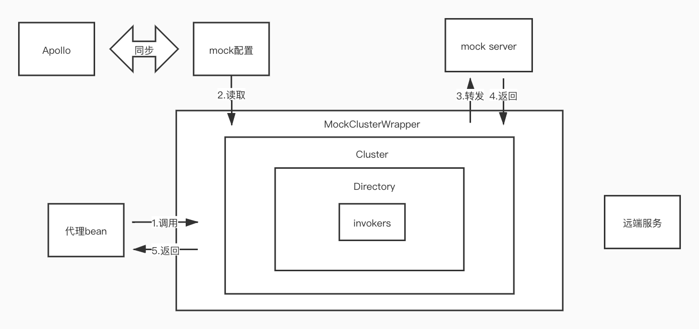

[](https://travis-ci.org/dsc-cmt/dubbo-easy-mock)
## 这个框架的作用
在自动测试中，针对dubbo接口进行mock的框架

## 原理
利用dubbo的扩展点自动包装，通过EasyMockClusterWrapper将原本的rpc请求改写为http请求转发到mock服务器返回我们对应mock结果



## 使用
### 1. 添加依赖
mvn clean package install (deploy) -Dmaven.test.skip=true 编译安装依赖到本地/远程仓库

对于apache版本dubbo 

```xml
<dependency>
    <groupId>com.cmt</groupId>
    <artifactId>dubbo-easy-mock</artifactId>
    <version>1.1.0</version>
</dependency>
```
### 2. classpath增加mock.properties
```
## 是否启用mock
easymock.enable=true
## mock服务器地址
easymock.server.url=https://easy-mock.com/mock/5c77afd53ecfbb573cba5df8/test
## 接口级别mock开关 
easymock.tests.HelloService=true
## 方法级别mock开关,优先级大于接口级别
easymock.tests.HelloService.hello=true
```

### 3. mock服务-请求约束

本框架对mock服务器不做限制，但是发送的mock请求需要遵循以下约束
1. 请求类型为GET，请求path为/接口全限定名/方法名
2. 返回格式为json  
对于基本类型，因为json仅支持对象和数组两种结构，所以需要用以下格式嵌套一层
```
{
    "data":xxx
}
```
对于其他类型，比如对象,Map,Collection等其他类型,与FastJson生成的一致即可

mock服务器推荐 [easy-mock](https://github.com/easy-mock/easy-mock)或者[mockserver](https://github.com/mock-server/mockserver)这两个项目

## 更新
2020-03-12 - 兼容apache和alibaba版本的dubbo

## 示例工程
[dubbo-easy-mock-demo](https://github.com/dsc-cmt/dubbo-easy-mock-demo)

## 相关文章
[针对Dubbo接口Mock的解决方案](https://www.jianshu.com/p/d71c7771b9c9)
